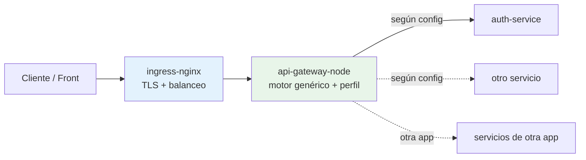
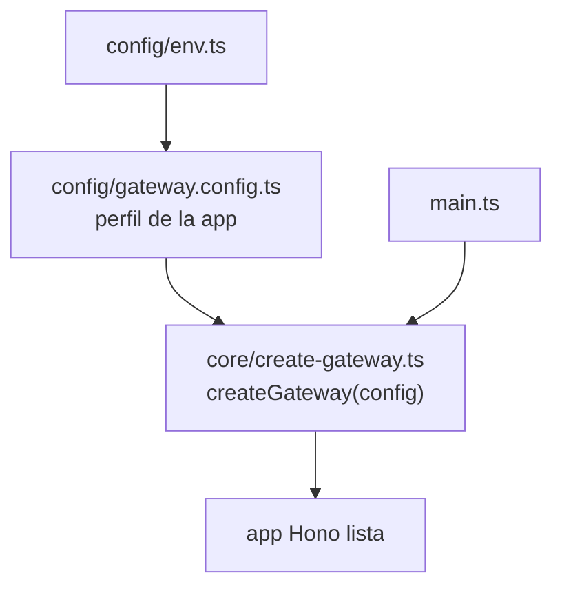

# api-gateway-node

**Gateway HTTP genérico, dirigido por configuración** (Hono + TypeScript). Verifica un JWT, inyecta contexto y hace reverse proxy a servicios downstream. El **motor no sabe nada del CRM ni de "organización"**: todo lo específico de una app vive en un archivo de configuración. Reutilizarlo en otra app = otro archivo de config, mismo motor.

> **Alcance de este repo:** solo el **backend** del gateway. Este corte es **README + estructura** (sin código de implementación todavía). El CRM es, aquí, **un perfil de ejemplo**; el núcleo es reutilizable tal cual.

---

## ¿Necesita base de datos (MySQL)?

**No.** El gateway es **stateless**:

- Verifica el JWT con la **clave pública** (sin consultar BD).
- Enruta por **configuración** (sin BD).
- Inyecta headers desde los **claims** del token (sin BD).

El único estado es el contador del **rate-limit**, que es **in-memory** y, para múltiples instancias, se sustituye por **Redis** (nunca MySQL). Por eso no hay ORM, ni driver de base de datos, ni migraciones. Mantenerlo sin BD es lo que lo hace genérico y horizontalmente escalable.

---

## Principio: motor genérico + configuración por app

La clave para que sea reutilizable es separar el **mecanismo** (idéntico en cualquier app) de la **configuración** (lo único que cambia):

| Genérico — el motor (`core/`) | Específico de la app (`config/`) |
|---|---|
| Verificar un JWT (firma, `iss`, `aud`, `exp`) | Qué `issuer` / `audience` / clave pública |
| Inyectar headers a partir de claims | **Qué claim → qué header** (aquí viven `org_id`, `country_code`…) |
| Reverse proxy por reglas de ruta | El **mapa de servicios** y las reglas |
| Rate-limit, CORS, request-id, errores | Los valores (ventana, origen permitido) |
| Anti-spoofing (sanear headers entrantes) | (se **deriva** del mapa de claims, no se configura aparte) |

La columna izquierda **no menciona "organización" ni "CRM"** en ningún lado. La derecha es un perfil que cambias por app.

---

## Responsabilidades (genéricas)

- **Punto único**: una sola URL pública; el cliente nunca habla directo con los servicios.
- **Reverse proxy**: reenvía cada petición al servicio destino según las reglas de ruta.
- **Autenticación de borde**: verifica el JWT con la clave pública. Rutas públicas sin token; el resto exige `Bearer`.
- **Inyección de contexto**: agrega headers de confianza derivados de los claims y **elimina** los que mande el cliente (anti-spoofing).
- **Transversales**: CORS, rate-limit, logging con request-id, errores uniformes, `/health`.

### Lo que NO hace (a propósito)

- No tiene lógica de negocio ni accede a ninguna base de datos.
- No conoce conceptos de dominio (organización, factura, etc.): solo proyecta claims a headers.
- No termina TLS ni balancea: eso lo hace **ingress-nginx** por delante.
- No guarda estado (salvo el rate-limit in-memory, reemplazable por Redis).

---

## Stack tecnológico

| Capa | Tecnología | Notas |
|------|------------|-------|
| Runtime | Node.js ≥ 20 | LTS |
| Lenguaje | TypeScript | `strict: true` |
| HTTP | Hono.js | framework web |
| Proxy | `fetch` nativo | reenvío de peticiones |
| JWT | `jose` | verificación RS256 (solo clave pública) |
| Validación de env | Zod | configuración tipada |
| Contenedores | Docker / MicroK8s | detrás de ingress-nginx |

Sin ORM, **sin base de datos**, sin `argon2`, sin librerías de Google: el gateway **solo verifica** el JWT de aplicación.

---

## Dónde encaja



---

## Estructura de carpetas

Separación tajante: `core/` es el motor reutilizable (cero referencias a ninguna app); `config/` es el perfil de **esta** app.

```
api-gateway-node/
├── README.md
├── package.json
├── tsconfig.json
├── .gitignore
├── .env.example
├── certs/
│   └── public.pem               # clave pública de auth-service (gitignored)
└── src/
    ├── core/                    # ── EL MOTOR (genérico, sin referencias a la app) ──
    │   ├── types.ts             # GatewayConfig, RouteRule, ClaimHeaderMap, Authenticator…
    │   ├── authenticator.ts     # puerto Authenticator + JwtAuthenticator (jose, RS256)
    │   ├── context.ts           # proyecta claims → headers y deriva el saneo anti-spoofing
    │   ├── router.ts            # matching de reglas (público/protegido)
    │   ├── proxy.ts             # reverse proxy (fetch) + saneo + inyección de headers
    │   ├── rate-limit.ts        # rate limiter (store inyectable; in-memory por defecto)
    │   ├── errors.ts            # cuerpo de error uniforme { code, message }
    │   └── create-gateway.ts    # createGateway(config) → app Hono
    ├── config/                  # ── EL PERFIL DE ESTA APP (lo único específico) ──
    │   ├── env.ts               # validación de variables de entorno (Zod)
    │   └── gateway.config.ts    # construye GatewayConfig: auth, servicios, rutas, claims→headers
    └── main.ts                  # carga config + createGateway + arranca el servidor
```

> Esta es la estructura objetivo. En este corte se entregan README y manifiestos; los archivos de `src/` se implementan en el siguiente paso.

---

## El punto de reutilización: `createGateway(config)`

El corazón del motor es una sola función:

```
createGateway(config: GatewayConfig): Hono
```

Recibe la configuración y devuelve la app lista. **Usarlo en otra app = escribir otro `gateway.config.ts` y llamar `createGateway` con él.** El `core/` no cambia nunca.



---

## Configuración del perfil

### Mapa claims → headers (aquí vive lo del CRM, como datos)

En lugar de codificar "inyecta `X-Organization-Id`", se declara un mapa. El motor lo itera; **"organización" es una fila, no código**:

```ts
// config/gateway.config.ts (ilustrativo)
auth: {
  publicKeyPath: env.JWT_PUBLIC_KEY_PATH,
  issuer: env.JWT_ISSUER,
  audience: env.JWT_AUDIENCE,
  claimHeaders: [
    { claim: 'sub',   header: 'X-User-Id' },
    { claim: 'email', header: 'X-User-Email' },
    // ↓ específicas del CRM: otra app simplemente las omite
    { claim: 'org_id',       header: 'X-Organization-Id' },
    { claim: 'country_code', header: 'X-Country-Code' },
  ],
}
```

La lista de headers a **sanear** (anti-spoofing) se **deriva** de este mapa: el motor borra del request entrante exactamente los headers que él mismo va a setear. Nada hardcodeado.

> Hoy el JWT de auth-service lleva `sub` y `email`; `org_id`/`country_code` se proyectarán cuando el token los incluya (al existir identity/organization). Mientras tanto, esas filas quedan listas sin efecto.

### Registro de servicios + reglas de ruta

Cada servicio se declara con su URL base (por env) y un conjunto de reglas. Se evalúan en orden; las públicas puntuales van antes del catch-all protegido.

| Método | Ruta | Servicio | Auth |
|--------|------|----------|------|
| POST | `/auth/register` | auth-service | público |
| POST | `/auth/login` | auth-service | público |
| POST | `/auth/google` | auth-service | público |
| POST | `/auth/refresh` | auth-service | público |
| POST | `/auth/logout` | auth-service | público |
| ANY | `/auth/*` (resto) | auth-service | **protegido** |

Agregar un servicio = añadir su URL + sus reglas en el perfil. **No se toca `core/`.** Rutas no declaradas → `404`.

### Authenticator como puerto (extensión a otros esquemas)

El verificador es un **puerto** inyectable, con `JwtAuthenticator` como implementación por defecto:

```ts
interface Authenticator {
  authenticate(req): Promise<AuthResult>; // { authenticated, claims }
}
```

Si otra app usa **otro esquema** (tokens opacos + introspección, API keys), implementa otro `Authenticator` y lo pasa en la config — sin tocar el resto. Para el caso común, el JWT por config alcanza.

---

## Verificación del JWT (authenticator por defecto)

- Algoritmo **RS256**; el gateway usa **solo la clave pública** (`certs/public.pem` por defecto, o `JWT_PUBLIC_KEY` inline).
- Valida firma, `iss`, `aud` y expiración.
- Rutas protegidas sin token válido → `401`. Rutas públicas: no se exige token.

> El gateway **reenvía** el header `Authorization` al downstream, así un servicio que verifique el token por su cuenta (como `auth-service` en `GET /auth/me`) sigue funcionando. La verificación del gateway es una **compuerta de borde** adicional.

---

## Inyección de headers de contexto

El motor proyecta los claims según el mapa y **borra** cualquier versión entrante (anti-spoofing). Para el perfil del CRM, hoy:

| Header | Origen | Cuándo |
|--------|--------|--------|
| `X-Request-Id` | uuid generado (o se propaga el entrante) | siempre |
| `X-User-Id` | claim `sub` | rutas protegidas |
| `X-User-Email` | claim `email` | rutas protegidas |
| `X-Organization-Id` | claim `org_id` | cuando el JWT lo lleve |
| `X-Country-Code` | claim `country_code` | cuando el JWT lo lleve |

> El gateway es el **único** que setea estos headers; los servicios confían en ellos porque viven detrás del gateway.

---

## Variables de entorno

| Variable | Ejemplo | Descripción |
|----------|---------|-------------|
| `NODE_ENV` | `development` | entorno |
| `PORT` | `8080` | puerto HTTP del gateway |
| `JWT_PUBLIC_KEY_PATH` | `certs/public.pem` | ruta a la clave pública (verificación) |
| `JWT_PUBLIC_KEY` | `-----BEGIN PUBLIC KEY-----…` | alternativa inline (prioridad sobre el archivo) |
| `JWT_ISSUER` | `auth-service` | emisor esperado |
| `JWT_AUDIENCE` | `crm-api` | audiencia esperada |
| `AUTH_SERVICE_URL` | `http://localhost:3001` | URL base de auth-service |
| `CORS_ORIGIN` | `http://localhost:5173` | origen permitido |
| `RATE_LIMIT_WINDOW_MS` | `60000` | ventana del rate-limit (ms) |
| `RATE_LIMIT_MAX` | `120` | máximo de peticiones por IP en la ventana |

> El gateway **solo** necesita la clave **pública**. La privada vive únicamente en auth-service.

---

## Requisitos y ejecución

- Node.js ≥ 20 y npm
- La **clave pública** de auth-service en `certs/public.pem` (o `JWT_PUBLIC_KEY` inline)
- auth-service accesible en `AUTH_SERVICE_URL`

```bash
npm install
cp .env.example .env      # y completar
npm run dev               # desarrollo con recarga
npm run build && npm start
```

**No hay migraciones ni base de datos**: el gateway no persiste nada.

---

## Reutilizar en otra app

**Camino recomendado ahora (config-driven en este repo):** núcleo genérico + un `gateway.config.ts` con el perfil. Reutilizar = copiar el repo y cambiar la config. Cero overhead.

1. Escribir un `config/gateway.config.ts` nuevo: su `issuer`/`audience`/clave, su mapa claims→headers, sus servicios y rutas.
2. Ajustar `config/env.ts` con las variables que esa app necesite.
3. `main.ts` ya hace `createGateway(config)`: no cambia.

**Camino futuro (si lo necesitas): extraer el núcleo como paquete** `@tuorg/gateway-core` que exporte `createGateway`, y que cada app sea un wrapper delgado con su config. Es lo "más genérico" de verdad (versionado, compartido entre repos), pero implica publicar y versionar. **No lo construyas todavía**: como `core/` ya está separado de `config/`, esa extracción luego es casi gratis (misma lógica que el "construye la costura ahora, enchúfala después" del multipaís).

---

## Rate limiting, CORS y errores

- **Rate-limit**: por IP, ventana fija. El store es **inyectable**: in-memory por defecto, **Redis** para multi-instancia. Excedido → `429`.
- **CORS**: restringido a `CORS_ORIGIN`.
- **Errores**: cuerpo uniforme `{ code, message }`. Downstream caído → `502`; ruta no declarada → `404`; sin token en ruta protegida → `401`; rate-limit → `429`.

---

## Seguridad

- Verificación estricta del JWT (firma, `iss`, `aud`, `exp`) con clave pública.
- **Anti-spoofing**: se sanean los headers de contexto entrantes; solo el gateway los setea (lista derivada del mapa de claims).
- Se eliminan headers hop-by-hop al reenviar.
- TLS lo provee ingress-nginx; el gateway escucha en texto plano dentro del clúster.

---

## Convenciones

- **Motor genérico**: `core/` no conoce ninguna app ni concepto de dominio.
- **Dirigido por configuración**: agregar servicios o claims es editar el perfil, no el motor.
- **Sin estado ni base de datos**: stateless, escalable en horizontal.
- Errores con cuerpo estándar `{ code, message }`, consistente con auth-service.
